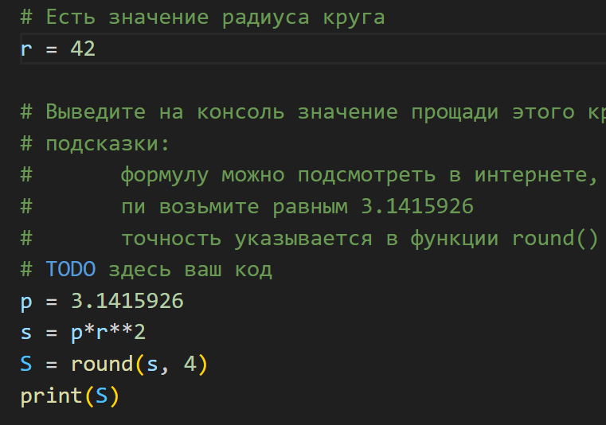
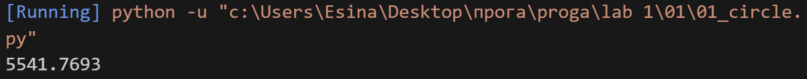
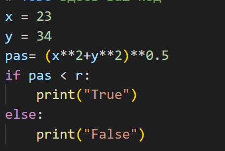
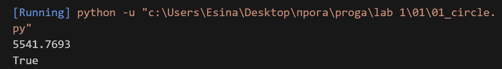
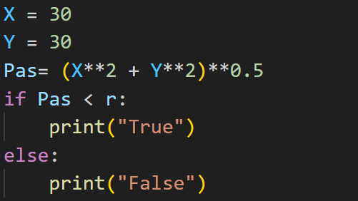
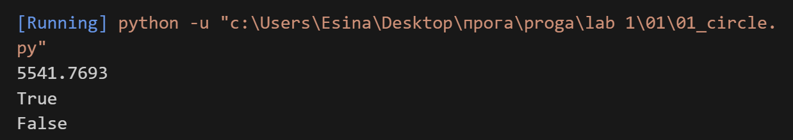

## Задание 
1 Часть

 **Есть значение радиуса круга**
 **r = 42**

 **Выведите на консоль значение прощади этого круга с точностю до 4-х знаков после запятой**
 **подсказки:**
       **формулу можно подсмотреть в интернете,**
       **пи возьмите равным 3.1415926**
       **точность указывается в функции round()**

## Описание работы 
*С помощью формулы и входных данных, я нашла прощадь и округлила до 4 знаков после запятой с помощью round()*

## Код 

## Вывод в консоле 

2 Часть 

**Далее, пусть есть координаты точки**
**point_1 = (23, 34)**
**где 23 - координата х, 34 - координата у**
**Если точка point лежит внутри того самого круга [центр в начале координат (0, 0), radius = 42],**
**то выведите на консоль True, Или False, если точка лежит вовне круга.**
**подсказки: нужно определить расстояние от этой точки до начала формула так же есть в интернете**
**квадратный корень - это возведение в степень 0.5**
**операции сравнения дают булевы константы True и False**

## Описание работы 
*С помощью формулы и входных данных, я нашла расстояние между точкой и центром окружности. После я сравнила расстояние с радиусом и с помощью сравнения выводила True или False*

## Код 

## Вывод в консоле 

3 Часть

**Аналогично для другой точки**
**point_2 = (30, 30)**
**Если точка point_2 лежит внутри круга (radius = 42), то** **выведите на консоль True,**
**Или False, если точка лежит вовне круга.**

## Описание работы 
*Работа выполнена аналогично второй части*

## Код 

## Вывод в консоле 

