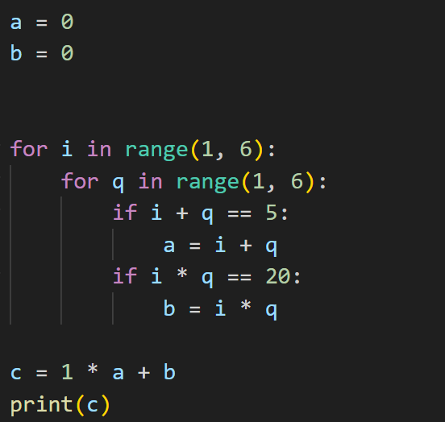
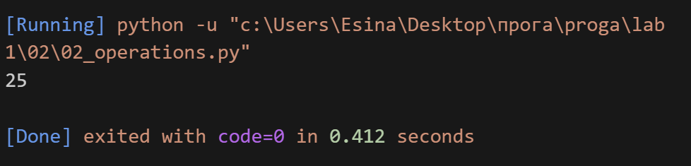

## Задание 
**Расставьте знаки операций "плюс", "минус", "умножение" и скобки**
**между числами "1 2 3 4 5" так, что бы получилось число "25".**

**Использовать нужно только указанные знаки операций, но не** **обязательно все перечесленные.**
**Порядок чисел нужно сохранить.**

## Описание работы 
*С помощью перебора я подобрала нужную комбенацию и получила ответ*

## Код 

## Вывод в консоле 

