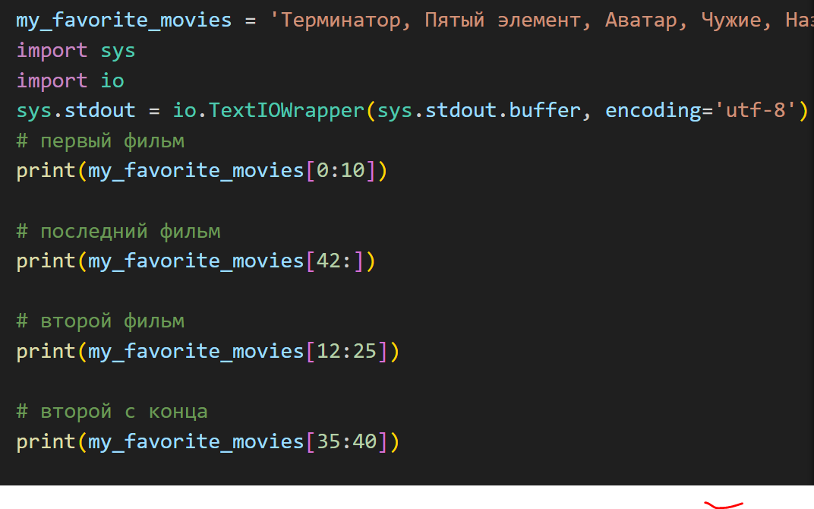
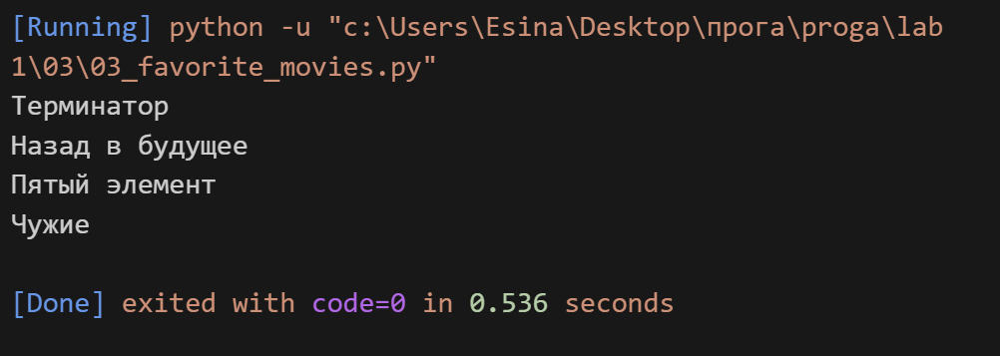

## Задание 

**Есть строка с перечислением фильмов**

**Выведите на консоль с помощью индексации строки,** **последовательно:**

**первый фильм**
**последний**
**второй**
**второй с конца**

**Запятая не должна выводиться.**
**Переопределять my_favorite_movies нельзя**
**Использовать .split() или .find()или другие методы строки** **нельзя - пользуйтесь только срезами,**
**как указано в задании!**

## Описание работы 
*Я сичатала индекты кажой буквы (начиная с 0) и с помощью срезов находила нужный мен фильм*

## Код 

## Вывод в консоле 

