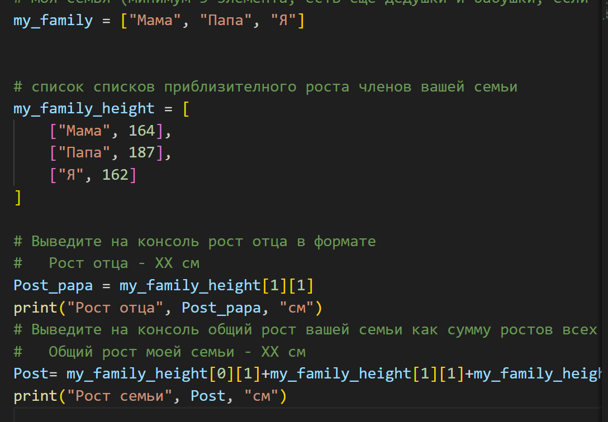
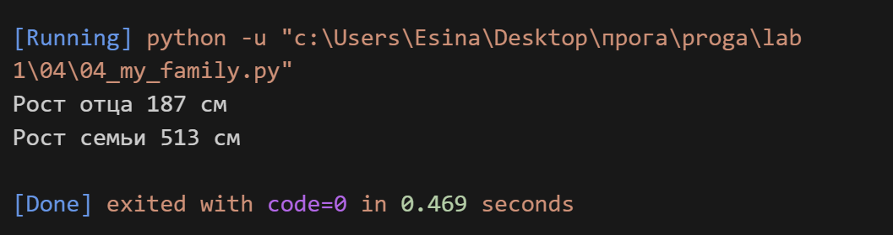

## Задание 

**Создайте списки:**

**моя семья (минимум 3 элемента, есть еще дедушки и бабушки, если что)**

**my_family = []**

**список списков приблизителного роста членов вашей семьи**
**my_family_height = [**
    **[],**
    **[],**
    **[]**
**]**

**Выведите на консоль рост отца в формате**

**Рост отца - ХХ см**

**Выведите на консоль общий рост вашей семьи как сумму ростов всех членов**

**Общий рост моей семьи - ХХ см**

## Описание работы 
*Я создала 2 списка. При помощи работы с индоксами я узнала первую переменную (рост отца), позже нашла все остальные переменные по такому же принципу и сложила их, чтобы найти сумму роста всех членов семьи*

## Код 

## Вывод в консоле 
