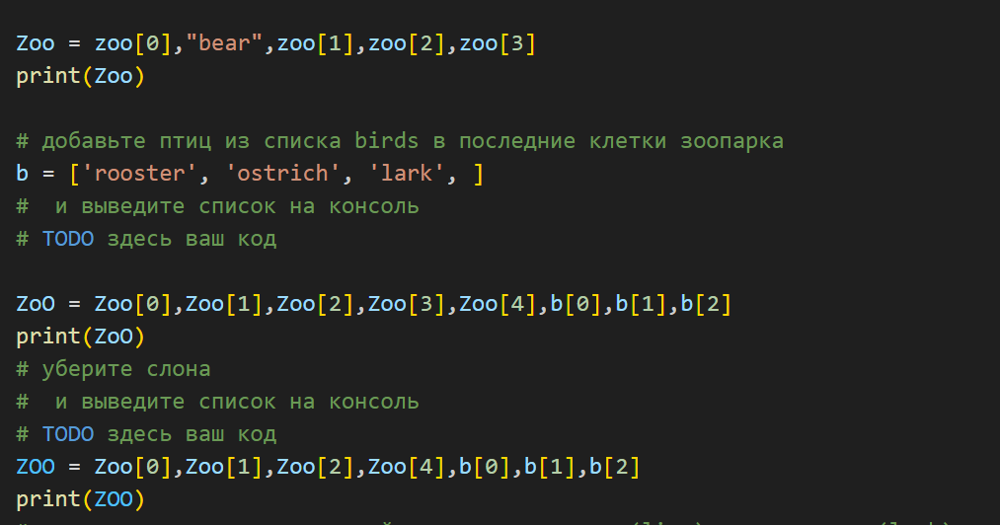
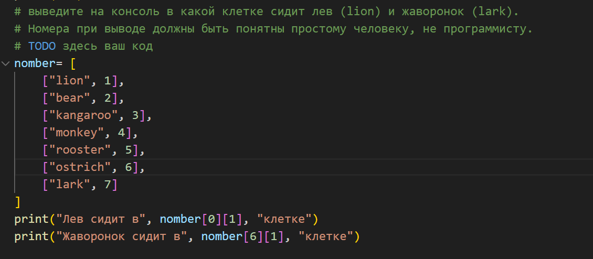
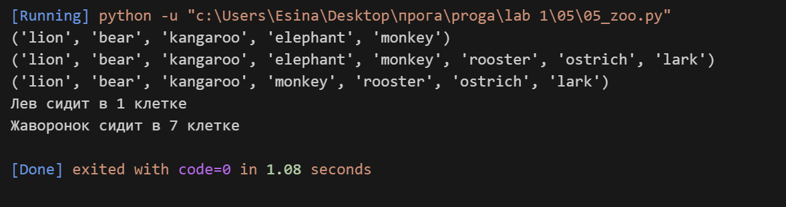

## Задание 

**Есть список животных в зоопарке**

**zoo = ['lion', 'kangaroo', 'elephant', 'monkey', ]**

**посадите медведя (bear) между львом и кенгуру**
**и выведите список на консоль**

**добавьте птиц из списка birds в последние клетки зоопарка**
**b = ['rooster', 'ostrich', 'lark', ]**
**и выведите список на консоль**

**уберите слона**
**и выведите список на консоль**

**выведите на консоль в какой клетке сидит лев (lion) и жаворонок (lark).**
**Номера при выводе должны быть понятны простому человеку, не программисту**

## Описание работы 
*Я работала со списком животных в зоопарке. Сначала вставила медведя между львом и кенгуру, собрав новый кортеж из элементов. Потом добавила птиц из отдельного списка в конец. Затем убрала слона, исключив его при создании новой версии списка. В конце посчитала номера клеток для льва и жаворонка, сделав отдельный список с номерами, чтобы человеку было понятно.*

## Код 

## Вывод в консоле 

