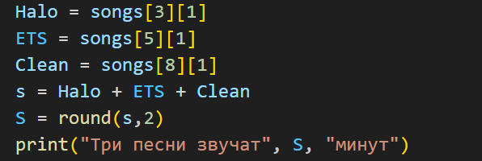
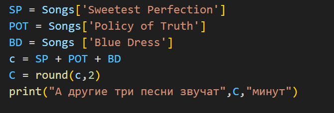
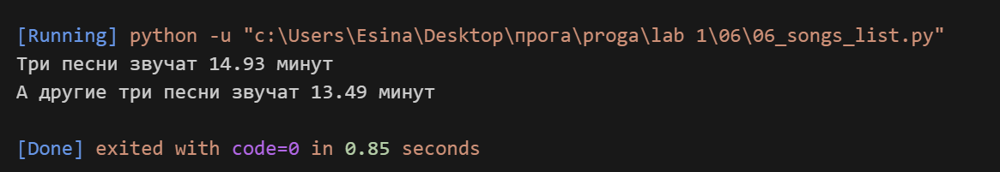

## Задание
Есть список песен группы Depeche Mode со временем звучания с точностью до долей минут
Точность указывается в функции round(a, b)
где a, это число которое надо округлить, а b количество знаков после запятой

songs = [
['World in My Eyes', 4.86],
['Sweetest Perfection', 4.43],
['Personal Jesus', 4.56],
['Halo', 4.9],
['Waiting for the Night', 6.07],
['Enjoy the Silence', 4.20],
['Policy of Truth', 4.76],
['Blue Dress', 4.29],
['Clean', 5.83],
]

распечатайте общее время звучания трех песен: 'Halo', 'Enjoy the Silence' и 'Clean' в формате
Три песни звучат ХХХ.XX минут
Обратите внимание, что делать много вычислений внутри print() - плохой стиль.
Лучше заранее вычислить необходимое, а затем в print(xxx, yyy, zzz)
Есть словарь песен группы Depeche Mode
Songs = {
'World in My Eyes': 4.76,
'Sweetest Perfection': 4.43,
'Personal Jesus': 4.56,
'Halo': 4.30,
'Waiting for the Night': 6.07,
'Enjoy the Silence': 4.6,
'Policy of Truth': 4.88,
'Blue Dress': 4.18,
'Clean': 5.68,
}

распечатайте общее время звучания трех песен: 'Sweetest Perfection', 'Policy of Truth' и 'Blue Dress'
А другие три песни звучат ХХХ минут

## Описание работы 
*Я работала с двумя разными наборами данных: списком и словарем. В первой части задания обратилась к элементам списка по индексам, чтобы получить время нужных песен ('Halo', 'Enjoy the Silence', 'Clean'), сложила их и округлила результат до двух знаков после запятой. Во второй части использовала ключи словаря, чтобы получить время песен 'Sweetest Perfection', 'Policy of Truth' и 'Blue Dress', тоже сложила и округлила. Все вычисления сделала до команды print, чтобы вывод был аккуратным.*

## Код 

## Вывод в консоле 

