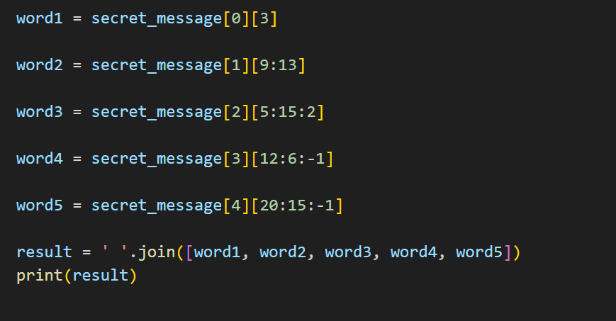
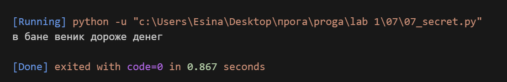

## Задание
Есть зашифрованное сообщение

secret_message = [
'квевтфпп6щ3стмзалтнмаршгб5длгуча',
'дьсеы6лц2бане4т64ь4б3ущея6втщл6б',
'т3пплвце1н3и2кд4лы12чф1ап3бкычаь',
'ьд5фму3ежородт9г686буиимыкучшсал',
'бсц59мегщ2лятьаьгенедыв9фк9ехб1а',
]

Нужно его расшифровать и вывести на консоль в удобочитаемом виде.
Должна получиться фраза на русском языке, например: как два байта переслать.
Ключ к расшифровке:
первое слово - 4-я буква
второе слово - буквы с 10 по 13, включительно
третье слово - буквы с 6 по 15, включительно, через одну
четвертое слово - буквы с 8 по 13, включительно, в обратном порядке
пятое слово - буквы с 17 по 21, включительно, в обратном порядке

## Описание работы
*Я расшифровала секретное сообщение, работая со срезами строк. Для каждого слова применила свой срез, учитывая, что номера букв начинаются с 1, а индексы в Python - с 0. Для четвертого и пятого слова использовала обратный шаг (-1), чтобы получить буквы в обратном порядке. В конце собрала все слова в одну фразу через пробел с помощью join.*

## Код

## Вывод в консоле 
