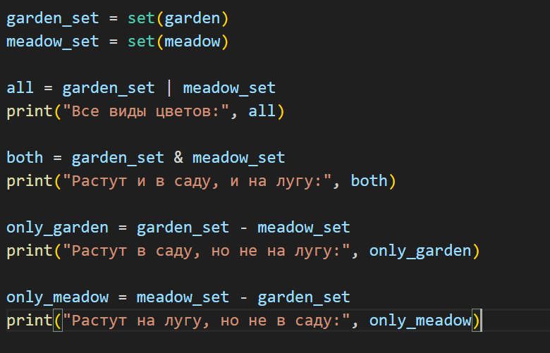
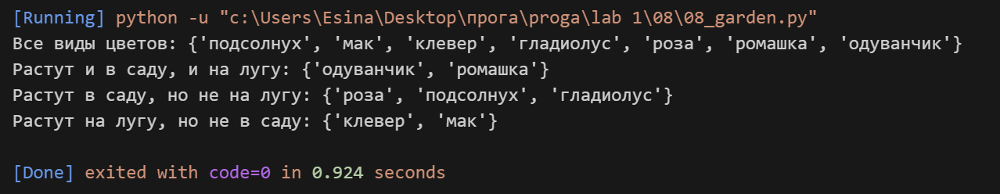

## Задание
в саду сорвали цветы
garden = ('ромашка', 'роза', 'одуванчик', 'ромашка', 'гладиолус', 'подсолнух', 'роза', )

на лугу сорвали цветы
meadow = ('клевер', 'одуванчик', 'ромашка', 'клевер', 'мак', 'одуванчик', 'ромашка', )

создайте множество цветов, произрастающих в саду и на лугу
garden_set =
meadow_set =
выведите на консоль все виды цветов
выведите на консоль те, которые растут и там и там
выведите на консоль те, которые растут в саду, но не растут на лугу
выведите на консоль те, которые растут на лугу, но не растут в саду

## Описание работы
*Я работала с кортежами цветов из сада и с луга. Сначала преобразовала их в множества, чтобы убрать повторяющиеся элементы. Потом использовала разные операции с множествами: объединение (|) чтобы найти все виды цветов, пересечение (&) чтобы найти общие цветы, и разность (-) чтобы найти уникальные для сада и для луга. Все результаты вывела на консоль с понятными подписями.*

## Код 

## Вывод в консоле 

