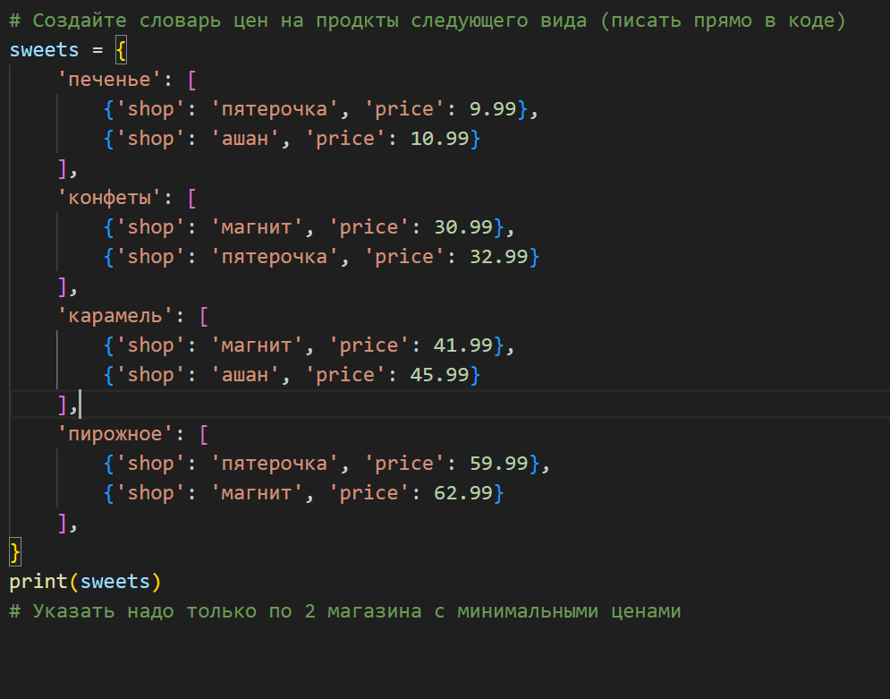
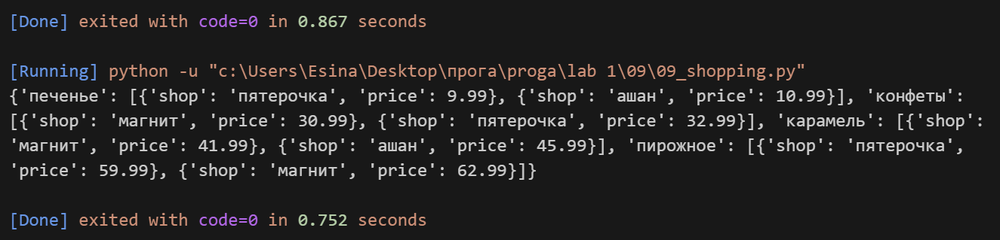

## Задание
Есть словарь магазинов с распродажами

shops = {
'ашан':
[
{'name': 'печенье', 'price': 10.99},
{'name': 'конфеты', 'price': 34.99},
{'name': 'карамель', 'price': 45.99},
{'name': 'пирожное', 'price': 67.99}
],
'пятерочка':
[
{'name': 'печенье', 'price': 9.99},
{'name': 'конфеты', 'price': 32.99},
{'name': 'карамель', 'price': 46.99},
{'name': 'пирожное', 'price': 59.99}
],
'магнит':
[
{'name': 'печенье', 'price': 11.99},
{'name': 'конфеты', 'price': 30.99},
{'name': 'карамель', 'price': 41.99},
{'name': 'пирожное', 'price': 62.99}
],
}

Создайте словарь цен на продкты следующего вида (писать прямо в коде)
sweets = {
'печенье': [
{'shop': 'пятерочка', 'price': 9.99},
{'shop': 'ашан', 'price': 10.99}
],
'конфеты': [
{'shop': 'магнит', 'price': 30.99},
{'shop': 'пятерочка', 'price': 32.99}
],
'карамель': [
{'shop': 'магнит', 'price': 41.99},
{'shop': 'ашан', 'price': 45.99}
],
'пирожное': [
{'shop': 'пятерочка', 'price': 59.99},
{'shop': 'магнит', 'price': 62.99}
],
}

Указать надо только по 2 магазина с минимальными ценами

## Описание работы
*Я создала новый словарь sweets, в котором для каждого продукта указаны два магазина с самыми низкими ценами. Для этого я проанализировала исходный словарь shops и выбрала минимальные значения по каждому продукту: для печенья — пятерочка (9.99) и ашан (10.99), для конфет — магнит (30.99) и пятерочка (32.99), для карамели — магнит (41.99) и ашан (45.99), для пирожного — пятерочка (59.99) и магнит (62.99). В конце вывела получившийся словарь на консоль.*

## Код

## Вывод в консоле

