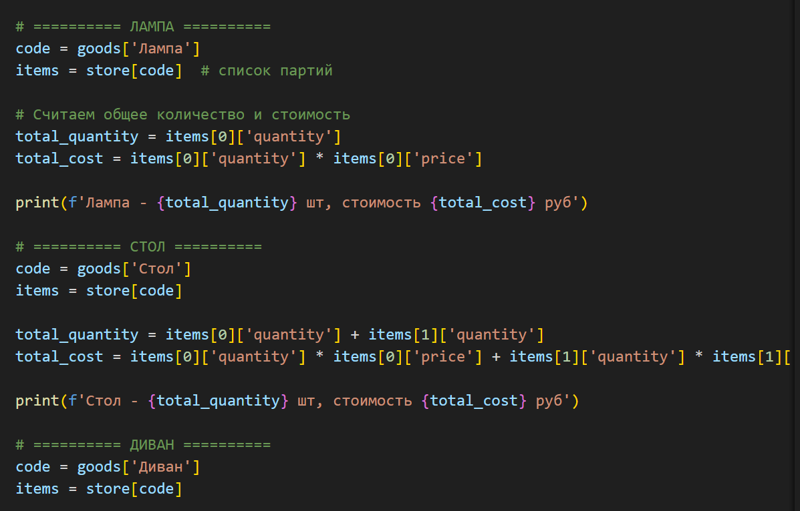
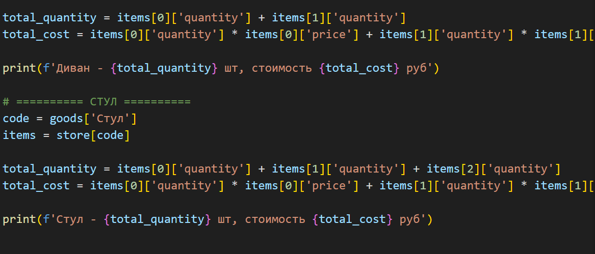
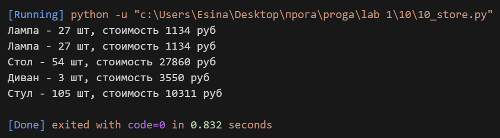

## Задание
Есть словарь кодов товаров

goods = {
'Лампа': '12345',
'Стол': '23456',
'Диван': '34567',
'Стул': '45678',
}

Есть словарь списков количества товаров на складе.

store = {
'12345': [
{'quantity': 27, 'price': 42},
],
'23456': [
{'quantity': 22, 'price': 510},
{'quantity': 32, 'price': 520},
],
'34567': [
{'quantity': 2, 'price': 1200},
{'quantity': 1, 'price': 1150},
],
'45678': [
{'quantity': 50, 'price': 100},
{'quantity': 12, 'price': 95},
{'quantity': 43, 'price': 97},
],
}

Рассчитать на какую сумму лежит каждого товара на складе
Вывести стоимость каждого вида товара на складе:
один раз распечать сколько всего столов и их общая стоимость,
один раз распечать сколько всего стульев и их общая стоимость,
и т.д. на складе
Формат строки <товар> - <кол-во> шт, стоимость <общая стоимость> руб

## Описание работы
*Я рассчитала общую стоимость каждого товара на складе. Для этого брала код товара из словаря goods, находила по нему список партий в словаре store, потом вручную складывала количество и стоимость по всем партиям. Для лампы получилась одна партия, для стола и дивана — по две, для стула — три партии. Все результаты вывела в нужном формате.*

## Код

## Вывод в консоле

