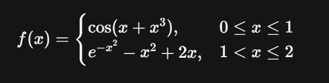
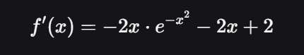

# Лабороторная работа 2

## __Часть 1__

Изучить построение графиков функций с использованием библиотек `matplotlib` и `numpy` с помощью книги [книга 1](https://evil-teacher.orbiter.website/books/prog_pm/matplotlib.pdf). 

## *Ход работы*
Я изучила 1-3 уроки. Все программы есть в папке "урок 1-3". Тут я приклеплю несколько программ и графиков, чтобы не перегружать отчет


### ***Урок 1***
В данном уроке мы знакомимся с полным кодом построения графиков. Изначально понятного было мало, но зато наглядно вижно что нас ждет.

# 1 код - построение прямом с помощью plot()


# 2 код - по сути такойже код + добавление сетки + изменение прямой + названия осей + заколовок графика 
.PNG>)
.png>)

# 3 код - код для 2 функций с более детальным описанием 


### ***Урок 2***
В данном уроке мы подробнее знакоминся с такими фуекциями как: plot(); xlabel()/ylabel(); title(); legend(); plt.grid(True). Также мы изучаем их "свойства" 

# 1 код - работа с цветом, размером шрифта, текстов и заголовками 


# 2 код - построение 4 линий на одном листе; работа с цветом и типом линий 


# 3 код - помтроение 4 линий на разных листах; работа с типом линий


### ***Урок 3***
В данном уроке мы глубже погружаемся в работу с цветом, сеткой, легендой и т д 

# 1 код - дитальная работа с легендой (задали имя конктретным линийям)


# 2 код - работа с крафиками на разный листак; меняем разполодение легенды 


# 3 код - работа с оформлением легенды 


### __Часть 2__

# ***Задание:***
Построить график этой функции и касательную к ней. Добавить на график заголовок, подписи осей, легенду, сетку, а также аннотацию к точке касания. 

### Вариант 1 


# ***Описание задачи***
Необходимо построить график кусочно‑заданной функции на отрезке 
[0;2] и провести касательную к ней в точке x0 =1,75. Требуется:
1) определить и визуализировать две части функции на соответствующих интервалах;
2) вычислить значение функции и производной в точке касания;
3) построить касательную линию;
4) оформить график с подписями, легендой, сеткой и аннотацией точки касания;
5) сохранить результат в файл изображения.

# ***Математическое описание функции***
Функция задана кусочно:



Производная для второго интервала (используется для вычисления углового коэффициента касательной):



Точка касания: 
x0 = 1,75

# ***Код на Python***

```python
import numpy as np 
import matplotlib.pyplot as plt 
from matplotlib.ticker import AutoMinorLocator

def f(x):
    if 0 <= x <= 1:
        return np.cos(x + x**3)
    elif 1 < x <= 2:
        return np.e**(-x**2) - x**2 + 2*x
    else:
        return np.nan 

# Векторизуем для работы с массивами
f_vec = np.vectorize(f)

def df(x):
    return np.e**(-x**2) * -2*x - 2*x + 2  

x0 = 1.75
y0 = f(x0)
k = df(x0)

def tangent(x):
    return k * (x - x0) + y0

x_1 = np.linspace(0, 1, 200)
x_2 = np.linspace(1.00001, 2, 200)
x_k = np.linspace(1.00001, 2, 200)

y_1 = f_vec(x_1)
y_2 = f_vec(x_2)
y_k = tangent(x_k)

fig, ax = plt.subplots(figsize=(10, 6))
ax.plot(x_1, y_1, '-b', linewidth=2, label='f(x) = cos(x + x^3)')
ax.plot(x_2, y_2, '-g', linewidth=2, label='e^(-x^2) - x^2 + 2x')
ax.plot(x_k, y_k, '--r', linewidth=2, label='касательная')

ax.scatter(x0, y0, color='red', zorder=5, s=80, label='Точка касания')

ax.annotate(f'Точка касания\nx₀ = {x0}\ny₀ = {y0:.3f}',
            xy=(x0, y0),
            xytext=(x0 + 0.2, y0 + 0.2),
            arrowprops=dict(arrowstyle='->', color='red'),
            fontsize=10,
            bbox=dict(boxstyle='square,pad=0.3', facecolor='yellow', alpha=0.3)
            )

ax.set_title('График функции и касательная к ней', fontsize=15)  

ax.set_xlabel('x', fontsize=15)   
ax.set_ylabel('y', fontsize=15)   

ax.legend()

ax.grid(which='major', linewidth=1.0)
ax.grid(which='minor', linestyle='--', linewidth=0.5, color='gray')
ax.xaxis.set_minor_locator(AutoMinorLocator())
ax.yaxis.set_minor_locator(AutoMinorLocator())

plt.tight_layout()
plt.show()
```

# ***Результаты вычислений***
### Параметры точки касания:
x0=1,75
y0=f(1,75)≈−0,556 (значение может незначительно отличаться в зависимости от вычислений)
угловой коэффициент касательной k = f′(1,75) ≈ −1,746

### Характеристики графика:
функция на отрезке [0;1]: f(x)=cos(x+x^3) (синяя линия);
функция на отрезке (1;2]: f(x) = e^(−x2) − x^2 +2x(зелёная линия);
касательная линия в точке (1,75;f(1,75)) (красная пунктирная линия).

# ***Визуализация***


# ***Анализ результатов***
График демонстрирует поведение кусочно‑заданной функции на заданном интервале. В точке 
x=1 наблюдается разрыв функции:
значение слева: cos(2)≈−0,416;
значение справа: e^(−1) − 1 + 2 ≈ 1,368.

Касательная линия наглядно показывает локальное поведение функции в окрестности точки x0=1,75. Угловой коэффициент касательной k≈−1,746 отрицателен, что соответствует убыванию функции в этой точке. Визуализация позволяет оценить характер изменения функции на разных участках и наглядно увидеть разрыв в точке x=1.


