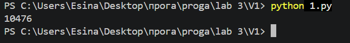
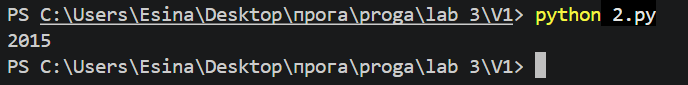
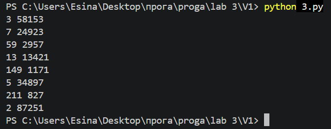

# Лабораторная работа 3

## Условия задач

### Задача 1 (Коды из букв)
Тимофей составляет 5-буквенные коды из букв Т, И, М, О, Ф, Е, Й.  
- Буква Й может использоваться в коде не более одного раза.  
- Й не может стоять на первом месте, на последнем месте и рядом с буквой И.  
- Все остальные буквы могут встречаться произвольное количество раз или не встречаться совсем.  

**Вопрос:** Сколько различных кодов может составить Тимофей?

---

### Задача 2 (Двоичная запись)
Вычислить количество единиц в двоичной записи значения выражения:

\[
4^{2020} + 2^{2017} - 15
\]

---

### Задача 3 (Делители)
Найдите среди целых чисел, принадлежащих числовому отрезку [174457; 174505], числа, имеющие ровно два различных натуральных делителя, не считая единицы и самого числа.  
Для каждого найденного числа запишите эти два делителя в два соседних столбца на экране с новой строки в порядке возрастания произведения этих двух делителей. Делители в строке также должны следовать в порядке возрастания.

---

## Описание проделанной работы

### Задача 1
Для решения использовался модуль `itertools.product`, который генерирует все возможные комбинации букв длиной 5. Далее производилась фильтрация по условиям:
- Подсчёт количества букв 'Й' (не более 1).
- Если 'Й' присутствует, проверка её позиции (не первая, не последняя).
- Проверка соседей 'Й' на наличие буквы 'И'.

**Код решения:**
```python
from itertools import product

def t():
    cl = 'ТИМОФЕЙ'
    k = 0

    for code in product(cl , repeat=5):
        if code.count('Й') == 1:
            pos = code.index('Й')
            if (pos != 0 and pos != 4) and (code[pos - 1] != 'И' and code[pos + 1] != 'И'):
                k += 1
        if code.count('Й') == 0:
            k += 1
    return k
print (t())
```
**Вывод результата:**




### Задача 2
- Подсчёт изначального числа
- Перевод в двоиную систему
- Подсчёт колличества "1"

**Код решения:**
```python
x = 4**2020 + 2**2017 - 15 
k = 0 
while x > 0:
    if x%2==1:
        k+=1
    x = x//2
print(k) 
```

**Вывод результата:**




### Задача 3
Для каждого числа в диапазоне от 174457 до 174505 находятся все его делители (кроме 1 и самого числа).
Если у числа ровно два таких делителя, они выводятся в порядке возрастания.

**Код решения:**
```python
for x in range (174457,174506): 
    a = []
    for d in range(2,x):
        if x % d == 0:
            a.append(d)
    if len(a) == 2:
        print (min(a), max(a))
```

**Вывод результата:**

 