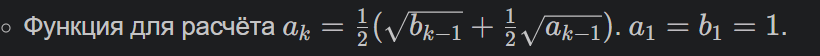
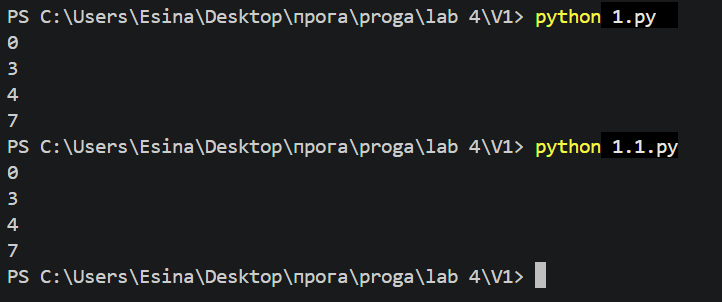
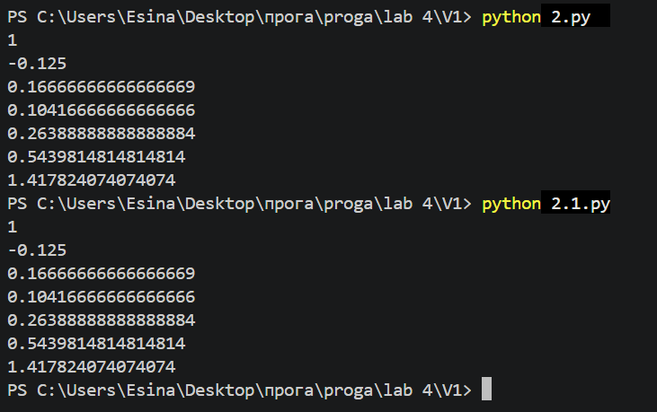

# Лабораторная работа 4

## Условия задач

### Задание 1. Подсчёт элементов во вложенных списках
Написать функцию, которая подсчитывает количество элементов в списке, включая все элементы вложенных списков.  
Примеры работы:

| Вызов функции | Результат |
|---------------|-----------|
| `count([])` | 0 |
| `count([1, 2, 3])` | 3 |
| `count(["x", "y", ["z"]])` | 4 |
| `count([1, 2, [3, 4, [5]]])` | 7 |

### Задание 2. Вычисление последовательности
Дана рекуррентная формула с начальными условиями:




Необходимо вычислить значения \(x_i\) для \(i = 1, 2, \ldots, 7\) двумя способами: с использованием рекурсии и без.

---

## Описание проделанной работы

### Задание 1

#### Рекурсивная версия
Функция `recursive(lst)` обходит список и каждый его элемент. Если элемент является списком, функция вызывает саму себя для этого вложенного списка и добавляет к счётчику результат рекурсивного вызова плюс 1 (за сам вложенный список). Если элемент не список, счётчик увеличивается на 1.

```python
def recursive(lst):
    if not lst:  
        return 0
    k = 0
    for i in lst:
        if isinstance(i, list):
           k += recursive(i) + 1
        else:
            k += 1
    return k
print(recursive([]))                    # 0
print(recursive([1, 2, 3]))             # 3
print(recursive(["x", "y", ["z"]]))     # 4
print(recursive([1, 2, [3, 4, [5]]]))   # 7
```

### Нерекурсивная версия (с использованием стека)
Вместо рекурсивных вызовов используется стек. В стек помещаются все встреченные списки. Пока стек не пуст, из него извлекается список, перебираются его элементы: каждый элемент увеличивает счётчик, а если элемент — список, он добавляется в стек для дальнейшей обработки.

```python
def recursive(lst):
    if not lst:
        return 0
    
    stack = [lst] 
    k = 0           
    
    while stack:                     
        cur = stack.pop()       
        for i in cur:           
            k += 1                   
            if isinstance(i, list): 
                stack.append(i)   
    
    return k

print(recursive([]))                    # 0
print(recursive([1, 2, 3]))             # 3
print(recursive(["x", "y", ["z"]]))     # 4
print(recursive([1, 2, [3, 4, [5]]]))   # 7
```


### Вывод результатов для 1 задания 



### Задание 2

### Рекурсивная версия
Функция `recursive(i)` вычисляет значение xi по формуле, вызывая саму себя для i−1 и i−2. Базовые случаи: i=1 и i=2.

```python 
def recursive(i):
    if i == 1:
        return 1
    if i == 2:
        return -1/8
    return ((i-1) * recursive(i-1)) / 3 + ((i-2) * recursive(i-2)) / 4
for i in range (1,8):
    print(recursive(i))
```

### Нерекурсивная версия 
Функция `iterative(n)` вычисляет значения последовательно, начиная с x1 и x2, и использует цикл для вычисления следующих членов.

```python 
def iterative(n):
    if n == 1:
        return 1
    if n == 2:
        return -1/8
    
    x1 = 1      
    x2 = -1/8   
    
    for i in range(3, n + 1):
        x3 = ((i-1) * x2) / 3 + ((i-2) * x1) / 4
        x1, x2 = x2, x3   
    
    return x2
for i in range (1,8):
    print(iterative(i))
```

### Вывод результатов для 2 задания 


