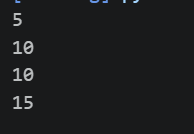
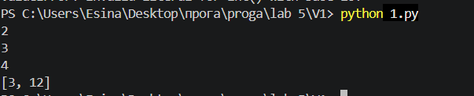

# Лабораторная работа 5

## Условия задач
### Задание 1
Создать замыкание `make_calc(operation, initial=1)`, которое:

1. Поддерживает 4 арифметические операции: '+', '-', '*', '/';

2. Накапливает результат, начиная с `initial`;

3. Возвращает функцию, которая при каждом вызове принимает число x, выполняет операцию над накопленным результатом и возвращает новое значение.

Примеры работы:

| Вызов функции                       | Результат |
|-------------------------------------|-----------|
| `calc = make_calc("*", initial = 1)`|           |
| `calc(5)`                           |     5     |
| `calc(2)`                           |     10    |

### Задание 2
Создать декоратор `collect_results`, который:

1. Запрашивает у пользователя число n;

2. Запускает декорируемую функцию n раз, каждый раз передавая ей ввод пользователя (число);

3. Возвращает список результатов.

---

## Описание проделанной работы

### Задание 1
Функция `make_calc(operation, initial=1)` возвращает внутреннюю функцию `calculator(x)`, которая имеет доступ к переменной `initial` через `nonlocal`. В зависимости от переданной операции (+, -, *, /) обновляет значение `initial` и возвращает его.


```python
def make_calc(operation, initial=1):
    def calculator(x):
        nonlocal initial
        if operation == '+':
            initial = initial + x
        elif operation == '-':
            initial = initial - x
        elif operation == '*':
            initial = initial * x
        elif operation == '/':
            if x != 0:
                initial = initial / x
        return initial
    return calculator

mult = make_calc('*')
print(mult(5))   
print(mult(2))   

add = make_calc('+', initial=0)
print(add(10))   
print(add(5))  
```
### Вывод результатов


### Задание 2
Декоратор `collect_results` оборачивает функцию, запрашивает у пользователя количество запусков n, затем n раз вызывает исходную функцию, передавая ей очередное введённое число, и накапливает результаты в список.

```python
def collect_results(func):
    def wrapper():
        n = int(input())
        results = []
        for i in range(n):
            result = func(int(input()))
            results.append(result)
        return results
    return wrapper


def make_calc(operation, initial=1):
    @collect_results
    def calculator(x):
        nonlocal initial
        if operation == '+':
            initial = initial + x
        elif operation == '-':
            initial = initial - x
        elif operation == '*':
            initial = initial * x
        elif operation == '/':
            if x != 0:
                initial = initial / x
        return initial
    return calculator


mult = make_calc('*')
print(mult())
```
### Вывод результатов


