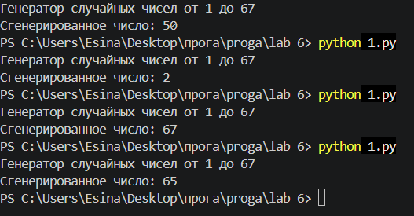

# Лабораторная работа 6

## Условие задачи
### Вариант 1
Написать генератор случайных чисел в диапазоне от 1 до 67.

**Требования:**
- Не использовать готовые реализации ГПСЧ (например, `random.randint()`)
- Диапазон: от 1 до 67 включительно


## Описание проделанной работы

### Алгоритм

Для генерации случайных чисел используется **линейный конгруэнтный метод (ЛКМ)**. Это один из самых простых и старых способов получения псевдослучайных чисел.

**Почему это работает:**  
Формула ЛКМ генерирует числа, которые равномерно распределены по всему диапазону. Остаток от деления на 67 даёт числа от 0 до 66, а прибавление 1 сдвигает в нужный диапазон 1–67.

**Зерно (seed):**  
В качестве начального значения `seed` используется текущее время в секундах (`int(time.time())`). Это обеспечивает разные последовательности при каждом запуске программы.

### Код

```python
import time

a = 1664525      
c = 1013904223   
m = 2**32        

seed = int(time.time())


def next_random():                   
    state = (a * seed + c) % m     
    return state                     

def random_in_range():
    rand_num = next_random()        
    result = (rand_num % 67) + 1
    return result

print("Генератор случайных чисел от 1 до 67")
print("Сгенерированное число:", random_in_range())
```
### Вывод результатов
