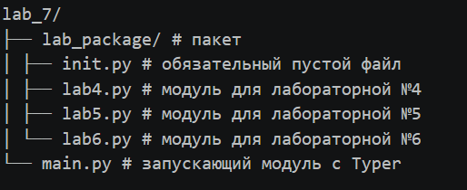
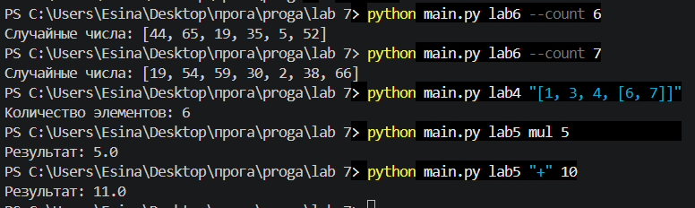

# Лабораторная работа №7

## Создание пакета и запуск через Typer

---

## Условия задач

### Задание
Создать пакет, содержащий 3 модуля на основе лабораторных работ №4, №5, №6. Написать запускающий модуль на основе библиотеки **Typer**, который позволит выбирать и настраивать параметры запуска логики из пакета.

### Что было в лабораторных работах №4, №5, №6

| № | Описание |
|---|----------|
| **№4** | Функция `recursive(lst)`, которая подсчитывает количество элементов в списке, включая элементы вложенных списков. |
| **№5** | Функция `make_calc(operation, initial)`, которая создаёт замыкание для накопления результата арифметических операций (+, -, *, /). |
| **№6** | Генератор псевдослучайных чисел от 1 до 67, реализованный линейным конгруэнтным методом (LCM) без использования встроенного модуля `random`. |

---

## Описание проделанной работы

### 1. Создание структуры пакета

Была создана следующая структура папок и файлов:




### 2. Содержимое модулей

#### Модуль `lab4.py`

```python
def recursive(lst):
    if not lst:
        return 0
    
    stack = [lst] 
    k = 0           
    
    while stack:                     
        cur = stack.pop()       
        for i in cur:           
            k += 1                   
            if isinstance(i, list): 
                stack.append(i)   
    
    return k
```

#### Модуль `lab5.py`
```python
def make_calc(operation, initial=1):
    def calculator(x):
        nonlocal initial
        if operation == '+':
            initial = initial + x
        elif operation == '-':
            initial = initial - x
        elif operation == '*':
            initial = initial * x
        elif operation == '/':
            if x != 0:
                initial = initial / x
        return initial
    return calculator


def collect_results(func):
    def wrapper():
        n = int(input("Сколько раз запустить? "))
        results = []
        for i in range(n):
            x = float(input(f"Введите число {i+1}: "))
            results.append(func(x))
        return results
    return wrapper
```
#### Модуль `lab6.py`
```python
import time

a = 1664525      
c = 1013904223   
m = 2**32        

seed = int(time.time())

def next_random():                   
    global seed
    seed = (a * seed + c) % m     
    return seed                     

def random_in_range(min_val=1, max_val=67):
    rand_num = next_random()        
    return min_val + (rand_num % (max_val - min_val + 1))

def generate(count=1, min_val=1, max_val=67):
    results = []
    for _ in range(count):
        results.append(random_in_range(min_val, max_val))
    return results

def init_rng(new_seed):
    global seed
    seed = new_seed
```

### 3. Содержание main.py
Для запуска использована библиотека Typer. Команды:

lab4 — подсчёт элементов в списке

lab5 — арифметические операции с накоплением

lab6 — генерация случайных чисел

## Код main.py:
```python
import typer
from typing import Optional
from lab_package import lab4 as lab4_module
from lab_package import lab5 as lab5_module
from lab_package import lab6 as lab6_module

app = typer.Typer(help="Выбор лабораторной работы (№4, №5, №6)")


@app.command()
def lab4(
    list_str: str = typer.Argument(..., help="Список, например: [1,2,[3,4]]")
):
    """Лабораторная работа №4 - Подсчёт элементов"""
    try:
        lst = eval(list_str)
        result = lab4_module.recursive(lst)
        typer.echo(f"Количество элементов: {result}")
    except Exception as e:
        typer.echo(f"Ошибка: {e}")


@app.command()
def lab5(
    operation: str = typer.Argument(..., help="Операция: +, -, mul, /"),
    x: float = typer.Argument(..., help="Число для операции"),
    initial: float = typer.Option(1, "--initial", "-i", help="Начальное значение")
):
    """Лабораторная работа №5 - Замыкание make_calc"""
    try:
        # Заменяем mul на * для вашей функции
        if operation == "mul":
            operation = "*"
        calc_func = lab5_module.make_calc(operation, initial)
        result = calc_func(x)
        typer.echo(f"Результат: {result}")
    except Exception as e:
        typer.echo(f"Ошибка: {e}")


@app.command()
def lab6(
    count: int = typer.Option(1, "--count", "-n", help="Количество чисел"),
    min_val: int = typer.Option(1, "--min", "-a", help="Минимальное значение"),
    max_val: int = typer.Option(67, "--max", "-b", help="Максимальное значение"),
    seed: Optional[int] = typer.Option(None, "--seed", "-s", help="Начальное зерно")
):
    """Лабораторная работа №6 - Генератор случайных чисел"""
    try:
        if seed is not None:
            lab6_module.init_rng(seed)
        results = lab6_module.generate(count, min_val, max_val)
        if count == 1:
            typer.echo(f"Случайное число: {results[0]}")
        else:
            typer.echo(f"Случайные числа: {results}")
    except Exception as e:
        typer.echo(f"Ошибка: {e}")


if __name__ == "__main__":
    app()
```

### Вывод результатов

